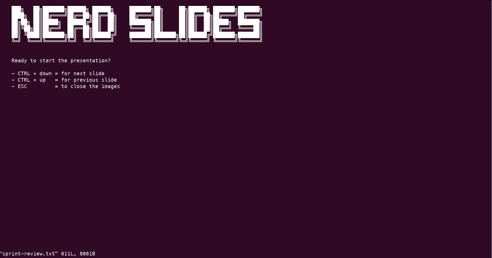

    ███╗   ██╗███████╗██████╗ ██████╗     ███████╗██╗     ██╗██████╗ ███████╗███████╗
    ████╗  ██║██╔════╝██╔══██╗██╔══██╗    ██╔════╝██║     ██║██╔══██╗██╔════╝██╔════╝
    ██╔██╗ ██║█████╗  ██████╔╝██║  ██║    ███████╗██║     ██║██║  ██║█████╗  ███████╗
    ██║╚██╗██║██╔══╝  ██╔══██╗██║  ██║    ╚════██║██║     ██║██║  ██║██╔══╝  ╚════██║
    ██║ ╚████║███████╗██║  ██║██████╔╝    ███████║███████╗██║██████╔╝███████╗███████║
    ╚═╝  ╚═══╝╚══════╝╚═╝  ╚═╝╚═════╝     ╚══════╝╚══════╝╚═╝╚═════╝ ╚══════╝╚══════╝
                                                                                   🐡
> a vim plugin to keep your presentations/slides nerdy 🤓 

## Features

- jump to the next slide (every slide has to start with `{page-head}` in order to be found)
- jump to the previous slide
- plot an image (one line under the `{page-head}` define the image `{image:./path/to/image}`)

## Requirements

- vim
- [feh - a fast and light image viewer](https://feh.finalrewind.org/)

## Installation
<details>
<summary>without plugin manager</summary>

1. In the terminal,
    ```bash
    mkdir -p ~/.vim/bundle/
    git clone https://github.com/roymanigley/nerd-slides-vim-plugin.git ~/.vim/bundle/nerd-slides-vim-plugin
    mkdir -p ~/.vim/plugin/
    ln -s ~/.vim/bundle/nerd-slides-vim-plugin/plugin/NerdSlides.vim ~/.vim/plugin/NerdSlides.vim
    ```
1. Restart Vim
</details>


<details>
<summary>Pathogen</summary>
Pathogen is more of a runtime path manager than a plugin manager. You must clone the plugins' repositories yourself to a specific location, and Pathogen makes sure they are available in Vim.


1. In the terminal,
    ```bash
    git clone https://github.com/roymanigley/nerd-slides-vim-plugin.git ~/.vim/bundle/.nerd-slides-vim-plugin
    ```
1. In your `vimrc`,
    ```vim
    call pathogen#infect()
    syntax on
    filetype plugin indent on
    ```
1. Restart Vim
</details>

<details>
  <summary>Vundle</summary>

1. Install Vundle, according to its instructions.
1. Add the following text to your `vimrc`.
    ```vim
    call vundle#begin()
      Plugin 'roymanigley/nerd-slides-vim-plugin'
    call vundle#end()
    ```
1. Restart Vim, and run the `:PluginInstall` statement to install your plugins.
</details>

<details>
  <summary>Vim-Plug</summary>

1. Install Vim-Plug, according to its instructions.
1. Add the following text to your `vimrc`.
```vim
call plug#begin()
  Plug 'roymanigley/nerd-slides-vim-plugin'
call plug#end()
```
1. Restart Vim, and run the `:PlugInstall` statement to install your plugins.
</details>

<details>
  <summary>Dein</summary>

1. Install Dein, according to its instructions.
1. Add the following text to your `vimrc`.
    ```vim
    call dein#begin()
      call dein#add('roymanigley/nerd-slides-vim-plugin')
    call dein#end()
    ```
1. Restart Vim, and run the `:call dein#install()` statement to install your plugins.
</details>

## Example Usage

> - bind the keys `CTRL+DOWN` to jump to the next slide
> - bind the keys `CTRL+UP` to jump to the previous slide

    nnoremap <C-down> :call NerdSlides#next()<CR>
    nnoremap <C-up> :call NerdSlides#previous()<CR>
    
> - overwrite the defult image background color 300a24 (default ubuntu background color)  

    let g:NerdSlides_ImageBackgroundColor = "none" 

### Examle

[example presentation](examples/sprint-review.txt)

### Usage



